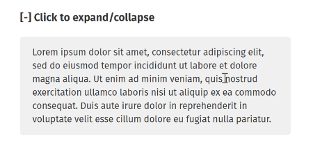

<div align="center">
<h1>Vue Slidable</h1>
Vue component-based utility for showing/hiding an element with "sliding" effect.

(Based on David Walsh's [Pure CSS Slide Up and Slide Down](https://davidwalsh.name/css-slide))


</div>

## Getting Started

```bash
npm install @yst/vue-slidable
```

Import and `use` it:

```js
import Vue from 'vue';
import Slidable from '@yst/vue-slidable';

Vue.use(Slidable);

// With options
Vue.use(Slidable, {});
```

⚠️ **Note**: This only provides the functionalities, so the styling is entirely up to you.

## Options

### Props

#### `expanded`

- type: `boolean`
- default: `false`

The slidable state basing on CSS [`max-height`](https://developer.mozilla.org/en-US/docs/Web/CSS/max-height) property.

#### `tag`

- type: `string`
- default: `div`

#### `easing.duration`

- type: `number | string`
- default: `300` (in milliseconds)

#### `easing.timingFunction`

- type: `string`
- default: `easeOutQuart`

For more easings, see [postcss-easings](https://github.com/postcss/postcss-easings/blob/master/index.js).

#### `updateOnResize`

- type: `boolean`
- default: `true`

Recalculates the container's `max-height` on [`window.resize`](https://developer.mozilla.org/en-US/docs/Web/API/Window/resize_event).

#### `debounce`

- type: `number` | `boolean`,
- default: 400

[Debounces](https://lodash.com/docs/4.17.15#debounce) the frequency of the component updates on data change.

#### `passive`

- type: `boolean`
- default: `true`

See [`passive` event listener](https://developer.mozilla.org/en-US/docs/Web/API/EventTarget/addEventListener) and how it could [improve performance](https://developers.google.com/web/tools/lighthouse/audits/passive-event-listeners) (on certain events).

### Model

```js
{
  model: 'expanded',
  event: 'change'
}
```

### Events

- `@expanded`
  Called when the containing component has opened/expanded (slides down).
- `@collapsed`
  Called when the containing component has closed/expanded (slides up).

### Example

```html
<h3 @click="toggle">Click to expand/collapse</h3>

<slidable tag="ul" v-model="show">
  <li>first item</li>
  <li>second item</li>
  <li>third item</li>
</slidable>
```

```js
export default {
  data: () => ({
    expanded: false
  }),

  methods: {
    toggle() {
      this.expanded = !this.expanded;
    }
  }
};
```

## License
[MIT](http://opensource.org/licenses/MIT)